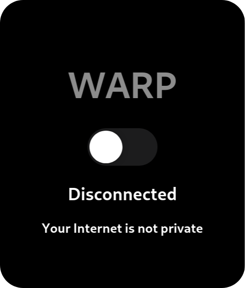

<div align="center">
  
  

  # ☁️ Cloudflare WARP Indicator

  *Seamless Cloudflare WARP integration for your GNOME Shell*

  <p>
    <a href="https://extensions.gnome.org/extension/6825/cloudflare-warp-indicator/">
      
    </a>
    <!-- <a href="https://github.com/depscian/cloudflare-warp-indicator">
      
    </a> -->
    <a href="https://github.com/depscian/cloudflare-warp-indicator/releases/latest">
      
    </a>
  </p>

  <p>
    
    
    
    
    
  </p>
  
  <br />

  <p>
    <a href="#-installation">
      
    </a>
    <a href="#-features">
      
    </a>
    <a href="#-preview">
      
    </a>
  </p>

</div>

---

## 📋 Overview

**Cloudflare WARP Indicator** supercharges your GNOME desktop with seamless integration for Cloudflare WARP zero-trust network connectivity. This sleek extension adds an elegant, feature-rich interface to your system tray, allowing you to connect, manage, and monitor your WARP connection with just a single click.

<div align="center">
  
  
  
</div>

## ✨ Features

<div align="center">
  <table>
    <tr>
      <td align="center">▶️</td>
      <td><b>One-Click Toggle</b>: Connect or disconnect with a single click</td>
    </tr>
    <tr>
      <td align="center">🎨</td>
      <td><b>Familiar UI</b>: 90% copied from the original macOS WARP GUI for seamless experience</td>
    </tr>
    <tr>
      <td align="center">📥</td>
      <td><b>Auto-Installation</b>: Can install WARP client if not already present</td>
    </tr>
    <tr>
      <td align="center">⚙️</td>
      <td><b>Low Resource Usage</b>: Minimal impact on system performance</td>
    </tr>
  </table>
</div>

## 📸 Preview

<p align="center">
  
  
</p>

## 🚀 Installation

Get up and running with the Cloudflare WARP Indicator in just a few clicks.

### ✨ Recommended: Install via GNOME Extensions

This is the **easiest and recommended** way to get the extension:

<div align="center" style="margin-bottom: 15px;">
  <a href="https://extensions.gnome.org/extension/6825/cloudflare-warp-indicator/">
    
  </a>
</div>

Just click the badge above and follow the instructions on the GNOME Extensions website.

<details>
<summary>🔧 Alternative: Manual Installation (for advanced users)</summary>

If you prefer installing from source:

1.  **Clone the repository:**
    ```bash
    git clone https://github.com/depscian/cloudflare-warp-indicator.git
    ```
2.  **Navigate into the directory:**
    ```bash
    cd cloudflare-warp-indicator
    ```
3.  **Run the install script:**
    ```bash
    ./install.sh
    ```
    *(Note: You might need to make the script executable first: `chmod +x install.sh`)*

</details>

<details>
<summary>✅ Prerequisites Checklist</summary>

Make sure your system is ready:

*   **GNOME Shell:** Version 45 or newer.
*   **Cloudflare WARP Client:** Must be installed. The extension can help install it if missing.
*   **GLib/Gio Libraries:** Usually included with GNOME.

</details>

## 💻 Usage

After installation, the extension is ready to use:

1. **Access**: Click the Cloudflare icon in your system tray
2. **Connect/Disconnect**: Toggle the switch to manage your WARP connection
3. **Status**: The icon and label show your current connection status
4. **First Run**: If WARP isn't detected, the extension will offer to install it for you

## 🛠️ Development

Interested in contributing or modifying the extension? Here's how to get started:

### Technology Stack

<div align="center">
  
  
  
</div>

### Project Structure

The codebase is organized for clarity:

```
cloudflarewarpindicator@depscian.com/
├── models/         # Data models and enums
├── services/       # Connection and installation services
├── utils/          # Utility functions
├── extension.js    # Main extension entry point
├── indicator.js    # UI implementation
└── warpController.js # Core WARP interaction logic
```
*(Note: The actual extension files reside within the `cloudflarewarpindicator@depscian.com/` directory).* 

### Setup & Making Changes

1.  **Clone the Repository:**
    ```bash
    git clone https://github.com/depscian/cloudflare-warp-indicator.git
    cd cloudflare-warp-indicator
    ```
2.  **Edit the Code:** Modify the JavaScript files within the `cloudflarewarpindicator@depscian.com/` directory using your preferred editor.

### Testing Your Changes

To see your modifications in action:

1.  **Install Locally:** Run the installation script to copy your modified files to the GNOME Shell extensions directory:
    ```bash
    ./install.sh 
    ```
    *(This overwrites any existing installation)*
2.  **Reload GNOME Shell:** Press `Alt` + `F2`, type `r`, and press `Enter`. Alternatively, disable and re-enable the extension through the GNOME Extensions app or website.

### Debugging

For troubleshooting, you can enable debug logging. Add `const DEBUG = true;` near the top of `cloudflarewarpindicator@depscian.com/extension.js`. Logs will appear in the system journal (`journalctl /usr/bin/gnome-shell`) or potentially in `/tmp/warp-extension-debug.log` depending on the setup. Remember to remove the debug flag before committing.

## 👥 Contributing

Contributions are welcome! Feel free to submit pull requests or open issues.

<div align="center">
  <a href="https://github.com/depscian/cloudflare-warp-indicator/issues/new">
    
  </a>
  <a href="https://github.com/depscian/cloudflare-warp-indicator/issues/new">
    
  </a>
</div>

## 📄 License

This project is licensed under the MIT License - see the [LICENSE](LICENSE) file for details.

---
> [!IMPORTANT]
> This extension is not affiliated, funded, or in any way associated with Cloudflare. It's an independent project designed to enhance the user experience of Cloudflare WARP on Linux.

<div align="center">
  <p>
    <a href="https://github.com/depscian/cloudflare-warp-indicator">
      
    </a>
  </p>
  
  <!-- <p>
    <a href="https://github.com/depscian/cloudflare-warp-indicator/stargazers">
      
    </a>
    •
    <a href="https://github.com/depscian/cloudflare-warp-indicator/network/members">
      
    </a>
    •
    <a href="https://github.com/depscian/cloudflare-warp-indicator/watchers">
      
    </a>
  </p> -->
</div>